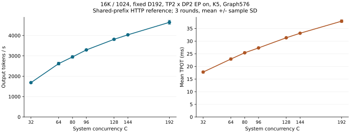

# 16K D192固定容量decode参考扫描结果

七档扫描已完成。本结果适用于一个真实16K共享前缀的HTTP prefix-cache参考负载，不是独立GovReport请求的PD性能上限。服务固定四卡TP2×DP2 EP on、DSpark K5、每DP引擎S96（合计D192）、Graph最大576。

| 全系统C | 正式轮×请求数 | 输出tok/s，均值±SD | CV | Mean TTFT，s | Mean TPOT，ms | K5 accepted/draft | 联合SLO |
|---:|---:|---:|---:|---:|---:|---:|---:|
| 32 | 3×128 | 1685.82±33.36 | 1.98% | 0.622 | 17.77 | 43.52% | 100.00% |
| 64 | 3×256 | 2618.75±68.90 | 2.63% | 0.723 | 22.92 | 43.41% | 100.00% |
| 80 | 3×320 | 2948.41±61.15 | 2.07% | 0.796 | 25.40 | 43.55% | 100.00% |
| 96 | 3×384 | 3292.18±44.12 | 1.34% | 0.917 | 27.32 | 43.21% | 100.00% |
| 128 | 3×512 | 3811.80±42.97 | 1.13% | 1.054 | 31.34 | 43.30% | 100.00% |
| 144 | 3×576 | 4033.63±33.81 | 0.84% | 1.052 | 33.14 | 43.38% | 99.77% |
| 192 | 3×768 | 4646.83±96.51 | 2.08% | 1.316 | 37.91 | 43.16% | 98.96% |

SLO使用逐请求TTFT≤10s且TPOT≤50ms，表中达标率是逐轮比例的均值。goodput和全部逐轮延迟在CSV中，单前缀下SLO达标不代表PD独立输入同样达标。

## 容量与前缀缓存工作量证据

| C | rank0/rank1 running采样峰值 | waiting峰值 | KV池占用峰值 | 正式JIT事件 |
|---:|---:|---:|---:|---:|
| 32 | 17/17 | 0 | 4.80% | 0 |
| 64 | 34/34 | 0 | 7.67% | 0 |
| 80 | 42/42 | 0 | 8.88% | 0 |
| 96 | 50/50 | 0 | 10.39% | 0 |
| 128 | 65/66 | 0 | 13.73% | 0 |
| 144 | 74/74 | 0 | 14.40% | 0 |
| 192 | 96/96 | 2 | 18.84% | 0 |

已保存21个正式轮、8832条成功请求、9,043,968输出tokens；0失败，抢占0，已识别正式JIT事件0。每个rank每轮前缀命中率均为98.4375%，computed-prefill均为256 tokens/请求。每请求输入16384、输出1024均经过官方客户端及服务计数器验收。

K5 accepted/output比为68.08%–68.88%，每请求draft次数319.1–327.5。该值与accepted/draft定义不同；每次draft生成5个候选token，不能将一次decode迭代视为只计算一个token。

## 解释与适用边界

本轮固定D192，只改变客户端C；它没有单独比较相同C下D144与D192服务容量的优劣，也未直接测出PD的最佳D配置。固定Graph576后，C64→C96没有出现旧D96/Graph192那种TPOT倍增。扩大客户端C确实增加了逐rank运行批量，不能再把高C误解为服务仍卡在合计64条。C增加时总体边际吞吐收益减弱、TPOT上升，需要结合PD普通对照和端到端SLO选择配置，不能只取吞吐最高档。

Graph初始化与startup证明target最高576、anchor draft最高480都已捕获，但离散Graph尺寸的padding仍会影响曲线；本轮没有逐步kernel trace，不能判断唯一算力/显存带宽瓶颈。KV池占用低、没有抢占只排除了容量耗尽的直接证据，不证明显存带宽有余量。

本次共享16K内容的K5接受率约43%，而旧8K共享内容约90%。8K/16K两批同时改变内容、长度及测量协议，不能按两个吞吐值直接量化上下文长度成本。本扫描在同一16K前缀内固定内容，适合检验容量扩展；推导真实PD配比时还需使用独立GovReport P/D服务证据。

CPU背景包含8个持续满核且可迁核的DOCA线程，affinity允许0–127；按忙线程utime增量观察其落点，未把空闲进程leader的last-CPU当作忙线程位置。服务CPU32–47及其SMT兄弟96–111、客户端48–55和PD代理CPU的逐轮busy/steal与线程落点都已保存；5秒采样无法排除瞬时竞争。未改变宿主CPU/NIC配置。本轮结果不称绝对硬件上限。

C192已保存2304条正式请求，其中TTFT>10s为7条、TPOT>50ms为17条（可重叠）；最大TTFT=25.11s、最大TPOT=56.62ms。首轮4条TTFT长尾的等待窗口都采到局部capacity waiting，未采到deferred waiting；没有逐请求DP路由ID，不能直接逐条归因。证据见[C192尾部采样](../data/decode-16k-d192-20260923-evidence.json)。全系统C恰好等于名义D容量，仍不保证每个DP rank无局部排队。

## 配置与计时

节点45后四卡，一个四卡TP2×DP2 EP on服务，DSpark K5；每个DP引擎max-num-seqs=96，服务名义合计容量192。FULL_DECODE_ONLY Graph最大576，来自每DP引擎96×(5+1)，不是全服务192×6。固定镜像的`_init_candidates`按query长度将capture sizes向上对齐，并受最大capture和max-num-seqs约束；启动日志实际完成23个target uniform descriptors（最高576）与23个DSpark anchor draft descriptors（最高480）的Graph捕获，前面的2/2只是显存估算。源码快照见本机`experiments/dsv4-night-20260923/preparation/pinned-cudagraph-utils.py`，采样运行数不代表每步恰好无padding。token预算16384，max-model-len32768，固定vLLM0.29.0镜像和NVFP4模型；FP8 KV。实际启动命令和容器验收以[实测命令](decode-16k-d192-20260923-commands.md)与[evidence.json中的server_facts](../data/decode-16k-d192-20260923-evidence.json)为准。

**case.json只供原生客户端构造，不是服务配置快照。** 它继承了旧节点、S48、Graph192、NIXL和cache-disabled描述；服务命令实际为本机45、S96、Graph576、prefix开启且不使用NIXL，不能从该继承对象推断本次服务行为。

服务CPU32–47/NUMA2，客户端48–55/NUMA3，端口31350；PD代理/client使用45的其他CPU组和端口。服务与其他实验不共用GPU。服务器JIT缓存保留；重置的是当前服务内存中的prefix cache，不删除磁盘编译缓存。

客户端使用固定镜像原生vLLM benchmark serve，`--request-rate inf`、`--max-concurrency C`、`--num-warmups 0`。本地JSONL适配器只替换数据加载，继续使用官方请求发送、持续补位、完整窗口计时和输出统计。每档C32/64/80/96/128/144/192，1轮2C完整预热，3轮各4C正式；正式请求为一轮持续补位，不拆成4个C批次。

每次预热和正式轮之前执行reset，随后2波、每波8条max_tokens=1的prime请求，检查两个DP rank都有prefix命中。reset和prime不进入吞吐分母。正式窗口仍包含HTTP、剩余prefill、调度、decode及返回；吞吐为官方完整窗口输出tokens/秒，没有扣除TTFT。每请求输入16384、输出1024，强制ignore_eos，温度0。

全部请求复用真实GovReport数据第一条的16384-token前缀，JSONL只用唯一ID复制到768行。因块大小256，观测命中16128/16384=98.4375%，仍计算256个输入tokens/请求。每轮独立保存逐rank命中、查询、computed-prefill、成功数和抢占数，不能把本测量描述成零prefill。

## 验收和边界

启动前检查实际补丁、模型/image ID、DSpark DP profiling修复、输入kernel和target/draft mHC预热。D192的draft预热边界扩展到576；四worker均完成两遍，缓存项不增长且scratch显存释放。启动后的8条小流量smoke有12条已识别JIT记录，属于准备窗口，完整正式预热另行执行。预热和正式日志分别存放，正式JIT、失败、抢占或computed-prefill超过256/请求均保留并停止扩展；三轮吞吐CV>5%也停止，禁止加轮挑选PASS。

## 数据与复现入口

[归档单条16K前缀](../data/decode-shared16k-prefix-20260923.jsonl)含1条真实GovReport前缀，SHA256 `27cc3c50b3a604604d14e2b624b7cdc5715135456c646e42d49e2a7cfdbc6399`；它的prompt与实测prompt.txt逐字相同。实际客户端使用768行唯一ID、相同prompt的数据集，SHA256 `65f87795cedaed3dcb50224b7765bcc31bda754139dfc25d96d93d46e3f2f114`，每档固定取前N条，不随机打乱。前缀共享是本扫描的明确设计，不是768条独立真实报告。

[逐轮CSV](../data/decode-16k-d192-20260923.csv)包含smoke、预热和正式阶段；本文性能表只用每档最初固定3个正式轮，全部保留。[证据JSON](../data/decode-16k-d192-20260923-evidence.json)保存服务事实、逐rank/GPU/CPU摘要、数据身份与独立复核。

实际服务启动与客户端命令从产物导出，见[实测命令](decode-16k-d192-20260923-commands.md)及[原始参数JSON](../data/decode-16k-d192-20260923-commands.json)。大日志、原生raw.json、逐请求记录、prefix reset/prime响应、startup覆盖记录、inspect和遥测仅在本机`experiments/dsv4-night-20260923/decode/`保留。原始controller.py与case/workload对象维持运行快照；其中case继承metadata不能代替实际服务CLI。模型容器已正常清理，JIT磁盘缓存保留。
