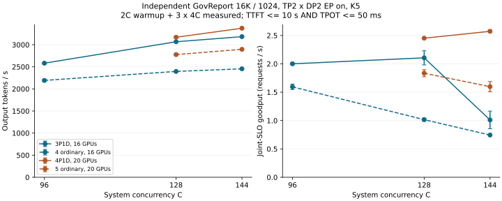

# 16K K5：Graph修正、3P1D容量与同资源普通对照

**修正Graph覆盖后，16卡3P1D在本轮C96／128／144均超过同16卡普通四服务的吞吐；TTFT与TPOT仍有取舍。** 三档吞吐变化分别为+17.82%／+28.03%／+29.67%。这适用于真实16K／1024、TP2×DP2 EP on、DSpark K5及下面的有限闭环协议，不代表所有负载或长期线上SLO。

图中3P1D的D随C取96／128／144，4P1D固定D144；普通各rank固定S32。误差棒为三轮样本SD。跨C按协议改变N及数据前缀数量，图示部署工作点，不是纯并发或纯D容量的因果曲线。

全部11个普通／PD／Graph对照部署已完成，最后一组结束于2026-09-23 06:15 北京时间；另有独立decode七档21轮。

## 16卡配对

每个服务4GPU：普通独立完成prefill＋decode，PD为3个P与1个D；两边使用完全相同的16张GPU与同档数据。延迟为Mean；SLO为逐请求TTFT≤10s且TPOT≤50ms。

| C | 普通四个完整服务，共16卡：tok/s | 3P1D，共16卡：tok/s | PD变化 | 普通TTFT／TPOT | PD TTFT／TPOT | goodput，普通→PD req/s | 联合SLO，普通→PD |
| ---: | ---: | ---: | ---: | --- | --- | --- | --- |
| 96 | 2192.03±27.08 | 2582.57±22.28 | +17.82% | 5.201s／37.226ms | 8.790s／26.132ms | 1.595±0.048→2.001±0.019 | 74.48%→79.34% |
| 128 | 2395.74±2.68 | 3067.25±9.80 | +28.03% | 6.363s／45.646ms | 11.722s／27.371ms | 1.016±0.027→2.106±0.125 | 43.42%→70.31% |
| 144 | 2454.89±8.83 | 3183.15±2.80 | +29.67% | 6.771s／50.607ms | 14.161s／28.057ms | 0.745±0.003→1.011±0.156 | 31.08%→32.52% |

C96→C128的3P1D吞吐增加18.77%，C128→C144仅增加3.78%。后者平均TTFT从11.722s升至14.161s，goodput从2.106降至1.011 req/s。吞吐更高并不自动意味着请求质量更好；三档均未达到95%联合目标。逐轮全部保留，goodput波动也不因吞吐SD小而隐藏。

逐请求拆分显示，3P1D三档所有SLO失败均来自TTFT，未出现TPOT>50ms；普通C128则有37.76%的请求仅TPOT超标，另4.36%两项同时超标。因此PD C128虽然平均首token更慢，联合goodput仍能提高。[SLO失败分类与首批拆分](../data/pd-16k-graph-capacity-20260923-slo-components.csv)保留每轮原分母，不用平均延迟代替逐请求验收。

## Graph配置对照

同16卡3P1D、D96/C96、N384、192条完整预热与三轮正式，固定其余服务参数、负载和放置，仅将D的Graph配置恢复到192上限：

| D96／C96，只改变D的Graph配置 | output tok/s | Mean TTFT／TPOT | goodput req/s | 联合SLO |
| --- | ---: | --- | ---: | ---: |
| Graph192，旧上限 | 1480.51±48.58 | 7.224s／55.114ms | 0.337±0.056 | 23.26% |
| Graph288，覆盖每rank48条 | 2582.57±22.28 | 8.790s／26.132ms | 2.001±0.019 | 79.34% |

补齐到288后吞吐变化+74.44%，TPOT变化-52.59%。这是同协议、仅改变D Graph服务配置的对照；旧历史N768/full-N预热的数据不参与这项计算。两组顺序运行，原P96期间45的独立decode扫描仍在进行，本次G96期间该模型已清理；P/D所在GPU不受这项共享，但控制机背景并非完全相同，未做随机化独立重启重复。结合固定镜像无匹配Graph时回退非Graph执行的代码路径，支持Graph覆盖不足是此前大batch失速的重要配置原因；本轮未做逐kernel硬件profiling，不宣称已测出唯一硬件瓶颈。

旧Graph三轮为1429.34→1486.17→1526.00 tok/s，CV3.28%，存在逐轮上升；全部保留，不称stable结果。每一轮仍明显低于Graph288，两个配置的正式轮均0已知JIT。草稿接受率46.96%与47.19%接近，输入/输出与真实KV验收一致。

按各轮请求窗口10%–90%采样，Graph192的D rank0/1平均运行45.40/45.53条，Graph288为39.18/39.28条；慢D让请求驻留更久，实际运行数反而更大。旧组偶有每rank1条capacity等待，D平均队列0.571s，KV峰值19.32%，没有抢占或整段输入重算。Graph改变也会改变闭环中的实际批量与P等待，不能将它等同于固定GPU batch的kernel微基准。

Graph覆盖还会影响配比判断：D执行变快后，系统更容易暴露P供给和首token等待。因此不能依据旧Graph192下的D96失速，继续把D64视作天然最佳容量；先消除配置限制，再比较P/D负载平衡。

## 增加P：20卡4P1D配对

P排队增加、D采样未见容量等待，为固定D144/C144增加一个P提供依据。新增服务占4GPU，总资源从16卡增至20卡，因此同时测普通五个完整服务：

| C144部署，每服务4卡 | 总GPU | output tok/s | Mean TTFT／TPOT | goodput req/s | 联合SLO |
| --- | ---: | ---: | --- | ---: | ---: |
| 3P1D，供给机制参照 | 16 | 3183.15±2.80 | 14.161s／28.057ms | 1.011±0.156 | 32.52% |
| 4P1D | 20 | 3373.48±18.13 | 9.183s／30.929ms | 2.574±0.023 | 78.12% |
| 普通五个完整服务 | 20 | 2896.22±19.32 | 5.920s／42.457ms | 1.598±0.091 | 56.48% |

4P1D相对同20卡普通的吞吐变化+16.48%，goodput变化+61.08%。相对16卡3P1D，增加25% GPU后吞吐变化+5.98%、TTFT变化-35.15%；这项跨资源变化用于分析供给机制，不能写成同资源部署收益。

4P1D把各P全轮请求的平均排队从约7.2s降至3.25–3.38s。另按各轮完整请求窗口10%–90%的1秒遥测，D中段每rank实际running增至60.58/60.43（3P为51.79/51.63）；此处与后文P供给分析的20%–80%交集窗口不同，不混用running均值。采样未见D capacity等待，KV峰值33.06%、无抢占。D批量增大后TPOT从28.057升至30.929ms。固定1024输出时，这相当于首token后的生成阶段多约2.94s，抵消了TTFT节省的约4.98s；Mean E2EL只从42.864降至40.824s，因此吞吐没有按P数量线性增长。

4P1D初始C的平均TTFT19.547s、达标率16.90%；后续3C为5.729s、98.53%。完整窗口仍只有约78%达标，不能把后续片段当作最终SLO。此组1728条正式请求中仍有2条TPOT>50ms，其余超标主要来自TTFT。与16卡3P1D较好的C128工作点比较，20卡4P1D C144的goodput约多22%，资源多25%；增加P有绝对容量和延迟收益，尚不能称资源效率普遍提高。

### 固定D144，降低C到128

保持4P1D全部服务参数、Graph、GPU/CPU放置与缓存路径不变，补测C128及同资源普通五服务。C128按协议使用256条预热、每轮512条正式；C144为288/576，因此数据池取前N条的数量也随C变化，不是固定N的严格单变量实验。

| C，固定D144／Graph432 | 普通五服务，共20卡 tok/s | 4P1D，共20卡 tok/s | PD吞吐变化 | 普通TTFT／TPOT | PD TTFT／TPOT | goodput，普通→PD req/s | 联合SLO，普通→PD |
| ---: | ---: | ---: | ---: | --- | --- | --- | --- |
| 128 | 2776.86±24.26 | 3169.16±18.91 | +14.13% | 5.477s／39.266ms | 8.477s／29.351ms | 1.835±0.063→2.452±0.007 | 67.64%→79.23% |
| 144 | 2896.22±19.32 | 3373.48±18.13 | +16.48% | 5.920s／42.457ms | 9.183s／30.929ms | 1.598±0.091→2.574±0.023 | 56.48%→78.12% |

4P1D从C144降至C128，吞吐变化-6.06%，Mean TTFT变化-7.69%，goodput变化-4.73%。该比较用于在同一D容量下选实际部署工作点，不将主线同时改变C/D的结果误当作单独D容量扫描。两档均保留完整窗口，首批填充不从分母剔除。C128的达标率为79.23%，比C144高1.11个百分点，仍未达到95%。固定D的这两个已测工作点中，C144吞吐与goodput更高，C128平均延迟略低；尚未测出满足95%目标的最佳并发。C128的D中段两rank平均运行53.97／53.84条，峰值各64，低于每rank72上限；采样未见capacity等待。P平均队列约2.82–2.94s。这组结果没有支持继续提高D上限来解决TTFT。

## 固定条件与测量协议

每个普通、P、D服务均占4张RTX6000D，拓扑TP2×DP2、EP on、DSpark K5。`S`表示**每个DP引擎**的`max-num-seqs`；两个DP引擎的名义服务容量为2S，不能跨rank共享。TP worker不增加请求名额。所有服务budget＝16K，即每引擎`max-num-batched-tokens=16384`；上下文上限32768，输入加输出不会越界。K5预留4个调度槽，budget16384不保证单条16384输入一次完成；[历史四槽对照](pd-dspark-budget-20260922.md)没有显示扩大budget的吞吐收益，本轮固定budget，不据此扩大参数矩阵。

固定vLLM 0.29.0，image ID `sha256:c2914767605584b6d8f45686b82de173ecc99e781897aa3d0a66dacd72c51ae1`；权重`/data/models/DeepSeek-V4-Flash-0731-NVFP4`不变，KV CLI为`fp8_e4m3`，DSV4使用稀疏MLA后端。K5采用greedy草稿与standard拒绝采样，关闭adaptive verification；不能直接与其他draft策略混算。所有普通和PD实验显式关闭本地prefix caching。

| 组别 | P每引擎S | D每引擎S／服务容量 | D Graph最大tokens | 服务数×每服务GPU＝总GPU |
| --- | ---: | --- | ---: | --- |
| 3P1D C96 | 32 | 48／96 | 288 | 4×4＝16 |
| 3P1D C128 | 32 | 64／128 | 384 | 4×4＝16 |
| 3P1D C144 | 32 | 72／144 | 432 | 4×4＝16 |
| 同协议Graph对照，3P1D C96 | 32 | 48／96 | **192** | 4×4＝16 |
| 4P1D C128／C144 | 32 | 72／144 | 432 | 5×4＝20 |
| 普通四／五个完整服务 | 每服务各rank均32 | 无P/D角色 | 各服务192 | 4×4＝16／5×4＝20 |

C始终是**客户端全系统在途上限**，request rate为inf；每完成一条便补位，并非同步定批次。每档1轮**2C完整生成预热**，随后3轮**各4C正式请求**：C96为192＋3×384，C128为256＋3×512，C144为288＋3×576。预热和功能请求不进入正式吞吐，正式轮全部保留，无性能重试。每个部署只启动一次；启动完成后先做多路由功能检查，之后才预热。每case预设4小时墙钟异常保护；09:30为查看节点，不用它截断主实验。

PD及普通使用同一1024条GovReport池的前N条，每条为真实报告**截取的精确16384-token前缀**，输出固定1024、ignore_eos；不是15–17K可变长完整报告。数据准备见[16K输入池](../data/govreport-16k-1024-preparation.json)。同一C的普通/PD数据完全相同；跨C时N和数据子集也随之改变，因此不能把所有差异只归因并发。主线同时提高C和D容量，用来评估部署工作点，不是二者的单变量归因实验。

客户端使用固定镜像内官方vLLM benchmark及本仓库JSONL适配，直接请求45上的代理。Output Token Throughput为全部成功输出tokens／完整客户端窗口，包含P排队、prefill、交接、KV传输、D调度与生成。PD代理不提前流出P的首token；TTFT是客户端收到D路径首个非空流式内容的时间，不能视为P计算结束时间。

SLO固定逐请求TTFT≤10s且TPOT≤50ms；goodput＝同时达标请求数／同一完整窗口，达标率＝达标数／总请求数。目标达标率95%，不能用平均TTFT或TPOT代替。吞吐为三轮均值±样本SD，延迟及达标率是逐轮指标平均，P95也不是合并请求后的P95。

## 放置、CPU与NIC

| 服务位置 | 节点／GPU | 服务CPU／内存NUMA | PD角色／普通角色 |
| --- | --- | --- | --- |
| 后四卡1 | 46／4–7 | 32–47／2 | P0／完整服务0 |
| 后四卡2 | 47／4–7 | 32–47／2 | P1／完整服务1 |
| 前四卡1 | 46／0–3 | 0–15／0 | P2／完整服务3（r3） |
| 后四卡3 | 48／4–7 | 32–47／2 | D／完整服务2（r2） |
| 20卡组新增 | 47／0–3 | 0–15／0 | P3／完整服务4 |

45统一控制：代理CPU16–19／NUMA1，客户端20–23／NUMA1。并行decode扫描独占45后四GPU、CPU32–47；decode客户端48–55。两条实验GPU、所分配服务/客户端CPU不重叠。45只负责控制并不强制其承担P/D角色。

PD使用NIXL/UCX，Docker映射`/dev/infiniband`、放开memlock，后四卡选mlx5_4–7、前四卡选对应近端NIC；HTTP、DP协调及每DP rank的NIXL侧信道端口分别核查，避免同节点服务冲突。完整环境、绑定、端口和实际argv从产物导出，见[实测命令](pd-16k-graph-capacity-20260923-commands.md)。普通使用相同GPU集合与代理least-inflight分流，未加NIXL消费者角色。

45存在8个持续忙碌且可迁核的DOCA线程，允许范围包含实验核及SMT兄弟；cpuset限制本次进程，不独占CPU。本次保留逐核busy/steal和DOCA线程采样，未停止或重绑宿主后台进程。代理采样未见CPU饱和；这不能排除瞬时竞争或把本次曲线称为绝对硬件上限。

## 启动准备与验收

先核对本地历史包含`c651fe4`、固定镜像/权重、空闲GPU、实际CLI、日志挂载、节点端口和NIC；保留JIT缓存并逐节点核对缓存内overlay哈希。沿用native MXFP4草稿分派、DP profiling回移、mHC、top-k和DSpark输入覆盖，避免旧缓存缺修复再次触发`16384 vs 160`。

准备阶段发现DSpark启动覆盖原硬上限512不足以支持每DP引擎S96，将有界上限扩至576并增加边界与GPU输入测试，提交`c210a41`。固定镜像内3个plan测试与2个输入测试通过；D192四worker完整启动、两遍cache key不增、临时allocated显存恢复基线，随后C4/N8 reset/prime功能验证通过，才放行两条并行主线。未改forward、模型精度或事件识别规则。

**K5按每DP引擎计算Graph：目标验证S×6，anchor草稿S×5。** D192是两rank各S96，因此目标576、草稿480，不是1152。固定镜像会按query长度构造/补齐离散Graph，超过最大捕获形状可能退回非Graph执行；Graph覆盖与JIT覆盖必须分别核查。D192最终target与draft各23个捕获形状；启动早期2/2只是内存估计阶段，不能误读为完整捕获数量。

每个PD正式轮核对D远端命中＝N×16384、实际NIXL字节及TP-rank传输数、全部P→D路由和两个DP引擎参与。脚本的D computed-prefill gate允许至多每请求1 token；本轮正式实测为0，归档另从counter逐轮确认，不由COMPLETE状态直接推断。普通核对总输入计算＝N×16384；双方成功输出＝N×1024。保留所有worker覆盖记录，传输失败/通知失败/KV过期、抢占与源码/config漂移检查。不能单凭HTTP成功判定PD传输成功。

功能阶段仍可见已知采样内核首次事件，单独保留；不能将“修好了定向预热”写成完全无需HTTP预热。此次按预定2C完整生成预热执行，正式事件另逐轮报告。0已知JIT不证明没有未识别编译、Graph总命中或性能已收敛，也不构成完整模型质量验证。

## P供给、D批量与初始填充

主线正式遥测样本中未观察到D capacity waiting；P服务平均队列时间随C96→128→144从约2.9s→4.9s→7.2s增加，D平均队列约0.26–0.29s。D实际running远低于名义C/D144，不能理解为144条全在D里解码。KV池没有占满及零抢占只排除了容量耗尽的直接证据，不能据此说明显存带宽有余量。

按代理真实`prefill_done`事件计数，取完整窗口20%–80%，与“首C的P响应全部返回后、首次D完成后、最后一次P请求发出前”取交集，使用同机monotonic计时，三P中段合计供给约2.771／3.419／3.562请求/s，D完成约2.811／3.392／3.514请求/s。C128→144三P供给只增4.16%，P阶段平均在途却从24.41增至34.50；C144 D运行约107.5条。闭环补位使P供给也受D完成节奏约束，这些不是孤立prefill-only最大能力；只能作为固定C/D增一个P的实验依据。

代理记录的P阶段平均耗时（含P排队、计算与P响应回传）分别约8.058／10.965／13.375s，对应客户端TTFT约8.790／11.722／14.161s。两种均值的比值约92%–94%，进一步支持优先检查P阶段；这不是逐kernel关键路径分解，P响应完成也不代表KV已经到达D。

按connector counter，每个16K请求记录2次TP-rank传输、合计172,385,280 bytes。各轮rank传输计时均值再取三轮平均，P96／128／144分别约98.74／89.63／95.94ms，4P C128／C144约108.39／107.43ms；旧Graph192对照为185.12ms。计时会受两侧执行和并发影响，不是纯链路带宽测试，也不是可与P/D阶段均值直接相加的单请求关键路径。没有传输错误、D整段重算或KV容量耗尽的证据；当前优先检查P阶段，不把跨节点带宽认定为主要瓶颈。逐轮sum/count保存在验收JSON中。

P运行约4条/服务也不意味着最多只能容纳4条；S限制序列名额，budget限制单步token工作，服务中的请求还可等待。`running`指标也不是每一步GPU kernel的精确batch，不能从采样直接推导硬件并行上限。

每轮客户端在约44–72毫秒内发起首C条请求，代理约0.11–0.20秒内完成首批路由。3P1D C96初始C平均TTFT17.783s，后续3C为5.793s；C128对应22.320／8.190s；C144为24.476／10.723s。初始突发显著影响完整窗口SLO，符合本轮rate=inf协议。后续请求包含不同文本和尾部排空，**不称严格稳态、不删首C、不改goodput分母**；比较普通时也需同样检查首批。

服务端queue/prefill/decode histogram分别是QUEUED→首次SCHEDULED、首次SCHEDULED→首次NEW_TOKEN、首次→最后NEW_TOKEN的墙钟阶段；包含调度间隔，不是纯GPU计算时间。NIXL均值是每rank的传输计时，不能与上述阶段均值简单相加当作精确TTFT分解。

## 与decode参照、历史结论的关系

[固定D192的16K扫描](decode-16k-d192-20260923.md)使用单一共享前缀且每轮reset/prime，98.4375%本地命中、残余256 input tokens/request；本报告PD使用独立报告、真实远端KV。共享前缀还可能改变KV访问局部性；两者DSpark接受率也不同（约43%与47%），因此不能拿decode最高吞吐直接当PD上限或相除得到“系统效率”。

旧8K共享内容的接受率约90%，与本轮16K同时改变内容、长度及协议；不能据吞吐差距把所有成本归给输入翻倍。8K单轮Graph修复提供了方向，本轮16K同协议Graph对照才用于核实历史D96性能下降的原因。

旧D64/C64、C80以及D96/Graph192结果仍是当时部署的有效数字，但不能外推为GPU在64批量后必然变慢。历史D96使用N768和完整N预热；本轮使用N=4C、2C预热，所以不把跨批次恢复幅度当成严格单变量Graph收益。

## 证据与复现入口

[逐轮CSV](../data/pd-16k-graph-capacity-20260923.csv)保留全部正式轮；[验收摘要](../data/pd-16k-graph-capacity-20260923-validation.json)保存逐服务启动覆盖、每轮工作量与传输计数；[完整argv快照](../data/pd-16k-graph-capacity-20260923-commands.json)与[可读命令](pd-16k-graph-capacity-20260923-commands.md)从真实产物导出。原始日志、逐请求记录与约7–8秒服务采样仅本机保存于`experiments/dsv4-night-20260923/{pd,ordinary,graph-control,ratio20,ratio20-c128}/results/`；1秒fast-metrics另在各工作区`reports/`。工作区配置、缓存与大日志不随Git提交。[P供给窗口CSV](../data/pd-16k-graph-capacity-20260923-p-supply.csv)及[10秒分箱](../data/pd-16k-graph-capacity-20260923-p-supply-10s-bins.csv)提供独立计数依据。

代码提交为`c210a41`；公共runner/client未修改。精确重放需要本机原始工作区、JSONL池和报告记录的挂载文件；迁移机器须重新核对模型、缓存overlay、GPU/NIC和端口，不能直接复制绝对路径即声称等价。
