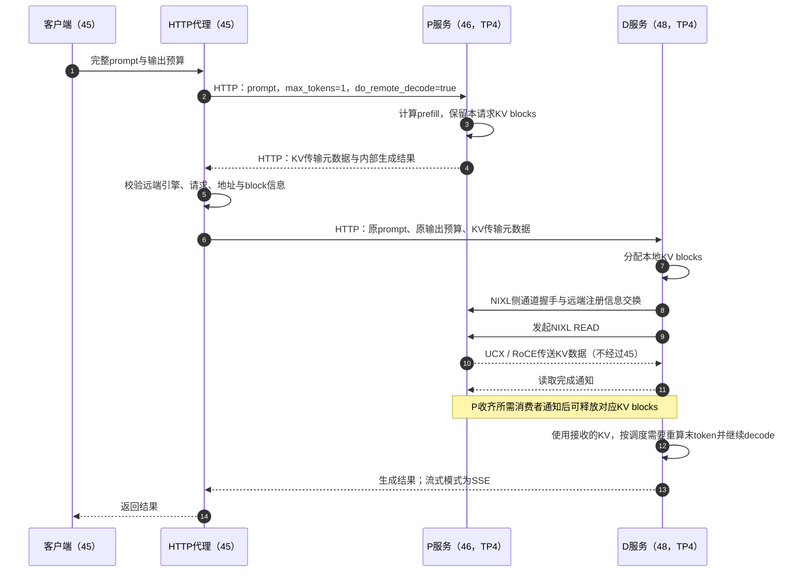

# 跨节点 PD 如何启动与协同

**每个 P/D 服务都从所在节点的本地磁盘加载一套完整的逻辑模型；45 统一启动和观察服务，代理安排请求先 P 后 D，KV 缓存由 D 通过 NIXL/UCX 从 P 直接拉取。** 模型权重不随请求跨节点搬运，KV 数据也不经过45代理。

本文解释2026-09-20首轮1P1D的实际部署与固定版本协议。两条C1请求已验证真实KV传输；输出正确性仍未定，尚无性能收益结论。实验已经结束并清理容器。结果与实际启动命令见[首轮报告](pd-1p1d-20260920.md)，后续阶段与预算见[实验计划](pd-1p1d-plan.md)。 后续已完成[有限功能检查与同资源quick对照](pd-screen-20260920.md)，本文的流程图仍对应同一实现。

## 服务部署：两套模型服务，共八卡

| 节点 | 本轮职责 | 模型服务数 | 每服务GPU数 | 模型并行 |
| --- | --- | ---: | ---: | --- |
| gpu-6000d-45 | SSH控制器、HTTP代理、功能客户端 | 0 | 0 | 无 |
| gpu-6000d-46 | P，计算输入的prefill | 1 | 4（GPU4–7） | 本机TP4、PP1、DP1 |
| gpu-6000d-48 | D，接收KV并生成输出 | 1 | 4（GPU4–7） | 本机TP4、PP1、DP1 |
| gpu-6000d-47 | 本轮未使用 | 0 | 0 | 无 |

这里的 **1P1D是1个P服务＋1个D服务，共2个模型服务、8张GPU**。本轮恰好每个服务占一个节点的四卡，实例数与节点数不能在其他配比中直接互换。45作为控制机不强制决定P/D角色。

每套模型在本地四卡之间分片；单张卡不装完整模型，两套服务之间也没有组成跨节点TP8。P与D均需要模型权重，因为prefill与decode都要经过模型各层，只是处理的token数量和调度阶段不同。

## 启动控制：45生成命令，SSH到节点执行

各节点已有本地镜像、模型和Git目录。本轮实际使用45仓库解析配置、生成Docker命令，再通过SSH在46/48执行；远端不需要各自进入Git目录运行一份runner，也不依赖四份工作树自动同步。

1. 45上的实验控制器读取deployment与两套campaign，保存配置、源码指纹和实际命令。
2. 经SSH检查远端镜像ID、GPU占用、模型元数据及拓扑；模型config、tokenizer和权重索引哈希一致，不等于全量权重内容已重新校验。
3. 在46/48分别执行生成的 `docker run`。每台挂载自己的 `/data/models/DeepSeek-V4-Flash-0731-NVFP4` 和持久化JIT缓存，使用本地固定镜像。
4. 45检查两端HTTP健康状态，持续收集日志、metrics与CPU/GPU/NIC遥测；就绪后由独立的代理和客户端执行请求。
5. STOP、期限或退出触发控制器收尾，核对本轮owner label后清理P/D容器。代理另行按本轮归属清理；权重、镜像与缓存保留。

启动控制器负责P/D服务生命周期，不会自行发起压测，也不会自动管理整套代理与客户端流程。当前入口是有界实验工具，部分预检仍固定了本项目的模型路径、镜像标签与NIC列表；不能直接当作任意模型、任意节点的生产编排器。

## 一条请求如何经过P、传输与D

下图按固定镜像的NIXL **pull / READ** 路径展示逻辑顺序；内部多个rank并行工作，不代表四个rank串行传输。握手信息可以复用，不要求每条请求重新建立所有连接。

P端内部请求的 `max_tokens=1` 用于完成该版本的交接流程。代理不把P生成的这个token拼接进客户端输出；D仍收到原始输出预算。首轮每条PD请求由D输出256 tokens，P另生成1个内部token。

P返回的 `kv_transfer_params` 包含 `remote_engine_id`、`remote_request_id`、`remote_host`、`remote_port`、`remote_block_ids` 和远端prefill标记。它们告诉D“去哪里、为哪个请求、读取哪些缓存块”，不是KV张量本身。代理校验元数据后随请求交给D，实际缓存注册、块映射、读取及完成通知由vLLM connector与scheduler处理。

D仍需原prompt来建立token序列、位置、采样和请求状态。**收到完整prompt不等于重新计算完整prefill**：远端命中信息使调度器等待KV加载，再继续生成；固定版本在完整远端命中时通常仍会重算prompt末token。P等待读取完成通知后可释放缓存，不必等D生成整段输出。

两端仍是完整的vLLM服务，producer/consumer角色配置本身不保证每条请求只执行P或D阶段。首轮也直接请求过D的普通推理路径作为参照。真正构成PD的是代理携带的元数据、connector传输和调度器对远端缓存的使用。

## 三条通信路径各自传什么

| 路径 | 内容 | 本轮入口 |
| --- | --- | --- |
| 45 → 46/48：SSH | 预检、启动命令、日志与清理 | 节点SSH访问 |
| 客户端 → 代理 → P/D：HTTP | prompt、采样参数、传输元数据、输出 | 45代理 `127.0.0.1:31250`；P/D服务各 `:31249`，监听 `0.0.0.0` |
| P ↔ D：NIXL/UCX | 侧通道交换注册信息，数据通道搬运KV | 侧通道host为 `10.90.1.46/48`、端口配置56300；RoCE使用 `mlx5_4–7:1` |

56300是NIXL侧通道配置，不是把所有KV塞进某个HTTP端口。两端容器使用host网络并访问 `/dev/infiniband`，UCX设置为 `rc,cuda_copy,cuda_ipc,sm,self`，GID index为3。具体命令从实测产物导出，统一保存在[结果报告](pd-1p1d-20260920.md#实际命令与复现入口)，本文不另维护一份启动脚本。

客户端端到端计时从请求代理开始，到接收输出结束，包含代理处理、P计算、KV传输、D排队与生成。NIXL内部的毫秒级传输计时只描述传输阶段，不能替代端到端延迟或直接用作PD加速比。

## 怎么确认是真PD，当前还缺什么

首轮每条PD请求的D端远端命中为8631 tokens，四个rank均完成接收，每请求共232,519,680 bytes。P网卡发送与D网卡接收增量相互对应；D的computed-prefill计数只对应额外执行的两条普通请求，没有随两条PD请求增加整段输入的计算量。联合证据排除了“HTTP成功，但D重算全部输入”的假成功。

代理缺失或收到不完整传输元数据时直接报错，不重试或回退普通请求；引擎配置 `kv_load_failure_policy=fail`。缺失元数据已用模拟HTTP测试验证，真实KV加载失败的负向GPU测试尚未执行。

结论限于固定 `vllm/vllm-openai:v0.29.0`、NIXL 1.3.2、image ID `sha256:c2914767605584b6d8f45686b82de173ecc99e781897aa3d0a66dacd72c51ae1`。这套模型使用DSV4特殊的packed MLA KV布局，CLI的FP8设置在日志中解析为 `fp8_ds_mla`；不能把它当作普通MHA的K/V数组任意复制。固定connector包含相关注册处理，但两条成功传输不足以覆盖滑动窗口、不同长度、并发和缓存生命周期的全部边界。

普通D重复请求本身也出现输出差异，因此本轮保留严格一致性检查FAIL，正确性结论仍为INCONCLUSIVE。DSpark off、非流式C1是已测范围；真实SSE链路、C32性能、PD＋DSpark兼容性均未通过本轮验收。CUDA缓存注册与RoCE流量已有证据，UCX内部完全不经主机暂存的零拷贝路径尚未独立证明。

## 实现与证据入口

- [pd_pair.py](../../../src/serving_bench/pd_pair.py)：SSH启动、P/D健康检查、日志遥测与有归属检查的清理。
- [pd_proxy.py](../../../src/serving_bench/pd_proxy.py)：先P后D、元数据校验、结果转发；另有普通副本轮询模式。
- [pd_probe.py](../../../src/serving_bench/pd_probe.py)：有界功能检查与输出对照。
- [配置边界](../../../docs/configuration.md#外部pd实验所需的本机启动参数)、[首轮实测](pd-1p1d-20260920.md)、[小型传输证据](../data/pd-1p1d-20260920-evidence.json)。
- 固定镜像构建版本的上游实现：[NIXL pull scheduler](https://github.com/vllm-project/vllm/blob/98dff2a81d747d1dba01a47f939f48c3526d4206/vllm/distributed/kv_transfer/kv_connector/v1/nixl/pull_scheduler.py)、[NIXL pull worker](https://github.com/vllm-project/vllm/blob/98dff2a81d747d1dba01a47f939f48c3526d4206/vllm/distributed/kv_transfer/kv_connector/v1/nixl/pull_worker.py)。解释依据为本轮从镜像提取的源码，不套用最新版本文档。

完整请求、日志、提取的镜像源码及探索配置仅保存在45本机 `/home/enhui/llm-serving-benchmarks/experiments/dsv4-pd-1p1d/`，不随Git分发。Git中的本说明、时序图、精选结果和小型数据用于交接；复现实验还需按计划准备本地部署配置与新的run-root。
