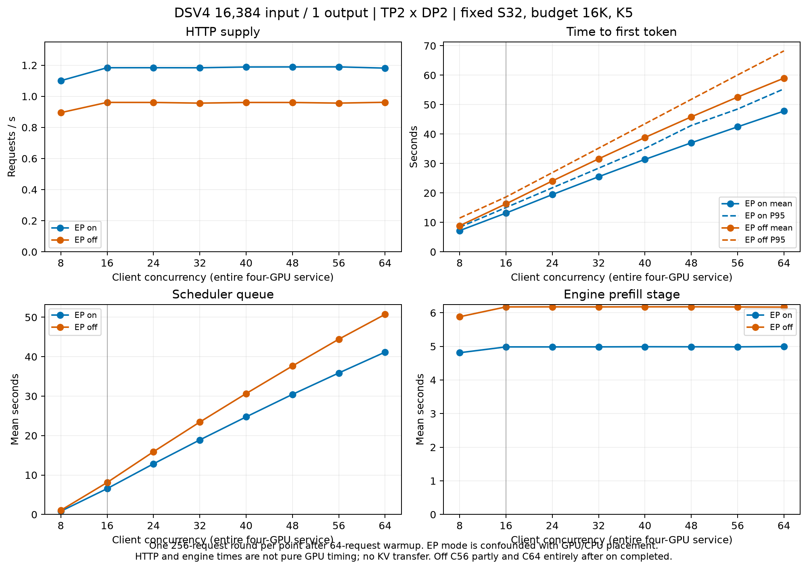

# 46单机16K/1：TP2×DP2 EP on/off prefill供给扫描

**两组在C16附近已接近本轮吞吐平台；EP on约1.18 req/s，off约0.96 req/s。C16后主要增加排队，未提高供给。** on在各相同C上吞吐高22.83%–24.36%、Mean TTFT低18.67%–19.23%；EP与后/前四卡位置及CPU背景绑定，只能作为快速筛选，不能把全部差异归因于EP。

优先保留两个工作点：**C16用于接近最大供给，C8用于较低TTFT。** C16已达各自本轮最大req/s的99.55%／99.93%；C8仍有92.53%／93.06%的最大供给，Mean TTFT仅7.212／8.868秒。两者之间的更细折中未测。本轮不测TP4、PD交接、其他budget或交换GPU位置，不宣称stable或普适最优。

## 并列表与曲线

真实独立GovReport前缀，输入16384、输出严格1；每服务4卡、每DP引擎S32/budget16384，单次启动固定参数。每C一轮64条预热＋一轮256条quick正式；下表均为单轮，TTFT列为Mean／P95，单位秒。

| C（整个四卡服务） | on req/s | off req/s | 输入tok/s，on／off | on TTFT，Mean／P95 s | off TTFT，Mean／P95 s | on吞吐变化 |
| ---: | ---: | ---: | ---: | ---: | ---: | ---: |
| 8 | 1.1005 | 0.8950 | 18031／14664 | 7.212／8.377 | 8.868／11.484 | +22.96% |
| 16 | 1.1840 | 0.9610 | 19399／15746 | 13.172／15.049 | 16.299／18.636 | +23.20% |
| 24 | 1.1840 | 0.9607 | 19399／15740 | 19.448／21.746 | 24.076／26.917 | +23.25% |
| 32 | 1.1837 | 0.9563 | 19393／15668 | 25.522／28.420 | 31.597／35.210 | +23.78% |
| 40 | 1.1886 | 0.9606 | 19475／15738 | 31.393／35.134 | 38.848／43.493 | +23.74% |
| 48 | 1.1891 | 0.9604 | 19482／15736 | 37.039／42.929 | 45.854／51.794 | +23.81% |
| 56 | 1.1894 | 0.9564 | 19487／15670 | 42.469／48.496 | 52.582／60.073 | +24.36% |
| 64 | 1.1813 | 0.9618 | 19355／15757 | 47.805／55.355 | 58.989／68.265 | +22.83% |

C8→16吞吐只增加7.59%／7.37%，Mean TTFT已增加约6.0／7.4秒；C16→64吞吐变化-0.23%／+0.07%，Mean TTFT却升至47.805／58.989秒。on最大观测值在C56（1.1894），off在C64（0.9618），与C16差距很小，单轮不足以证明这些更大C更好。平台判断来自整段曲线，不是NVML利用率或某个最高值。

## 排队与执行证据

| C | on平均调度排队 s | off平均调度排队 s | on平均prefill阶段 s | off平均prefill阶段 s |
| ---: | ---: | ---: | ---: | ---: |
| 8 | 0.817 | 1.053 | 4.812 | 5.883 |
| 16 | 6.555 | 8.106 | 4.986 | 6.175 |
| 24 | 12.840 | 15.903 | 4.986 | 6.178 |
| 32 | 18.899 | 23.430 | 4.987 | 6.176 |
| 40 | 24.740 | 30.655 | 4.991 | 6.178 |
| 48 | 30.447 | 37.649 | 4.989 | 6.179 |
| 56 | 35.872 | 44.437 | 4.988 | 6.175 |
| 64 | 41.166 | 50.739 | 4.997 | 6.170 |

prefill阶段来自`request_prefill_time_seconds`，包括引擎内从首次调度到首token的相关时间，不是纯GPU计算计时，也不能与HTTP TTFT简单相减得到某个独立硬件阶段。C16–64时on约4.99秒、off约6.18秒；排队随C持续增长，支持“增加等待而非增加供给”的解释。

5秒轻量采样中，每DP引擎running峰值均为2（远低于配置上限32）。C16时on两引擎平均running为1.93／1.96、waiting为4.21／3.46；off为1.95／1.97、3.81／4.09。C64平均waiting分别升至24.73／23.99和24.14／24.42，采样峰值均29。waiting_by_reason全部落在capacity，deferred为0；这个分类不等于证明触及max-num-seqs。16K token budget、草稿输入槽、DP调度和KV分配共同限制可执行批量，本轮没有逐step profiler来拆分其贡献。

on/off可用KV内存分别23.36／20.05 GiB/GPU，引擎报告KV容量61,002／52,349 tokens。正式KV占用采样峰值约53.72%／62.60%；16轮均0抢占，不能据此把平台解释成KV已满。每轮两DP完成量均被验收，主要为127–129条；on C8为135／121。逐DP完整分布、running/waiting/KV均值和峰值见[小型JSON](../data/prefill-ep-16k-20260923.json)。

正式GPU平均利用率约97.6%–99.9%，平均每卡功耗on约276–291 W、off约269–287 W，SM时钟约2.415／2.420 GHz；没有改功耗或锁频。NVML忙碌不证明计算或带宽已饱和，TP2组间和MoE通信、调度、草稿工作仍包含在供给曲线内。

## 口径、验收和保留的警告

- 两次模型启动、16单元全部完成，性能重试0次。每单元256成功、0失败，输入4,194,304、输出256 tokens；正式合计4096请求、67,108,864输入、4096输出tokens。1024条预热请求和16条功能请求单独保存，未计入正式统计。服务累计各完成2568条，与8功能＋8×(64＋256)一致。
- 原JSONL SHA256为`025246b18d8ba7e1bc4d98c1a20b32b570860bb06a0baf0cea4ae97403d982e7`；1024条不同ID，固定镜像tokenizer逐条核验输入精确16384。原文件未改，派生输出1的SHA256为`4effcb83c8d3203e53f3c81b61537e5d24da8c814263539f2aa29cc100266101`。每档前64条预热、前256条正式，双方相同顺序。temperature0、ignore_eos=true、request_rate=inf，prefix caching关闭，无reset/prime。
- 每正式轮客户端记录与服务的完成、输入、输出、computed-prefill计数一致，prefix hits为0、无远端KV connector。computed-prefill指标是`prompt_tokens−cached_tokens`的服务记账，**不是独立硬件计算计数器**；结合禁缓存、无传输和0抢占支持完整输入处理，未使用重型profiler。
- 固定客户端单token流式测试覆盖普通文本和空文本特殊token，首choices事件记录TTFT，usage尾事件不充当首token。HTTP完整请求窗口不剔除首尾。TPOT/ITL记为null／不适用；output tok/s数值等于req/s，不代表decode能力。
- 两组32个预热/正式阶段均0已知JIT事件；每worker input、target mHC、draft两遍覆盖通过，临时allocated增量0。两组实际SP分别true／false。CLI保留Graph192及历史16个捕获尺寸；日志初期2/2是profiling，最终13/13捕获另有各worker完成证据，未把早期2/2当最终集合。
- **coordinator持续报告统计step乱序，on 721条、off 708条。** 固定源码比较跨engine共享的最近wave/step；落后另一engine即可触发，警告后仍更新LB快照，不抛异常或丢请求。快照参与新请求路由，可能影响排队与吞吐，不能称为无代价噪声。它不直接改变scheduler真实队列；Prometheus走独立engine→API统计路径，HTTP/完成counter验收仍有效。源码依据见[警告核查](prefill-ep-16k-20260923-warnings.md)。
- `api_server_count>1`只禁用控制台LoggingStatLogger，PrometheusStatLogger仍启用。另保留SM120 SymmMem不支持、TP2 FlashInfer all-reduce不可用、实验NVFP4格式及参数弃用警告；未修改事件规则、隐藏warning或放宽gate。温度明确覆盖为0，不沿用模型默认1。

## 与真实PD生产端的差异

固定vLLM0.29.0中，TP2×DP2 EP on的routed MoE为EP4；off将MoE张量切分跨TP×DP展开成四卡，不是两个仅两卡通信的模型。DSV4的sequence parallel在on启用、off关闭。mHC入口相同，但token分片形状不同；本次扩展启动模块到off，保留完整1–16384分派覆盖和实际SP校验，没有修改forward、量化或kernel。

`max_tokens=1`不会关闭DSpark。K5 anchor有5个query位置，scheduler仍预留K−1＝4个新输入槽；空batch的16384输入会受16380＋剩余4的分块边界影响，混合调度可进一步分块。V2 runner在speculator存在时仍调用propose，处理target辅助hidden、draft KV和输入槽；首token后的请求结束使本轮“草稿验证/接受”计数为0，这不证明没有执行propose。异步输出拷贝在propose前建立，也不能把整个草稿时间全算入HTTP TTFT。

本轮是直连HTTP近似prefill-only，含排队、prefill、首token采样与返回。与真实P端相比移除了NIXL注册、post-forward KV交接、异步传输和相关KV保留生命周期，也没有代理与D侧路径。因此不能将单P req/s乘3预测PD吞吐或TTFT。

## 对后续PD优化的意义与边界

3000 output tok/s／1024输出约需2.93 req/s，三个P平均约需0.98 req/s。on C8实测1.10 req/s、C16约1.18 req/s，高于这个粗略平均需求；off平台约0.96 req/s接近但略低。**这说明on值得作为后续供给候选，继续提高单P客户端C很难帮助；不证明真实3P已充分供给。** KV交接、D需求突发、P路由、共享资源与尾延迟仍可能使PD首token受限。

背景3P1D C104/D112约2721.58 tok/s、Mean TTFT9.466秒；C128/D128约3067.25 tok/s、11.722秒，P budget16K→32K此前没有明确收益。本轮支持优先研究请求分配、P端排队与真实交接过程，而不是继续堆单P并发或把S32容量上限当成瓶颈；本次没有自动追加这些实验。

EP与GPU位置固定绑定：on后四卡/NUMA2/CPU32–47，off前四卡/NUMA0/CPU0–15，客户端分别48–51/NUMA3、16–19/NUMA1，彼此及服务不共享物理核。仍有12个既有DOCA高CPU进程，运行期负载会迁移到本次CPU或其SMT兄弟；cpuset不是独占。正式宿主忙碌约14.6%–19.7%，客户端及其SMT背景变化明显，可能影响初始化、请求供给和时延。

两组同日17:39启动，17:42全部验收后独立扫描；on约18:29清理，off约18:37清理。on各正式窗口均与off服务共存；off C56仅约63.65%的正式窗口仍有on服务，C64完全在on结束后。相同C不代表同一时间窗口，不能将这种快速对照解释为隔离条件下的因果EP收益。单轮没有跨轮均值±标准差，不声明stable或硬件极限；没有交换GPU位置复核。

## 复现与归档

[逐档CSV](../data/prefill-ep-16k-20260923.csv)、[小型验收/遥测JSON](../data/prefill-ep-16k-20260923.json)、[产物导出的实际命令](prefill-ep-16k-20260923-commands.md)、[完整复现依赖与准备入口](../reproduction/prefill-ep-20260923/README.md)。复现快照保存两组配置、相对路径依赖及自动运行/分析脚本；大JSONL、固定权重/镜像和已有JIT缓存作为校验身份明确的外部输入，不复制进Git。

原始结果**仅46本机可用**：`experiments/dsv4-prefill-ep-20260923/results/scan-01/`；完整准备和失败的离线检查证据在该工作区`evidence/`，包括早期SSH/数据阻塞、缓存读取权限、CLI挂载和合成SSE检查的纠正，未消耗模型重启或性能重试。此后两组模型各启动一次，服务运行期间源码/配置未变，冻结哈希保留。准备与实验从17:23恢复至18:37完成，约74.5分钟，未达到4小时总预算。

120项通用测试通过（8项环境相关测试跳过），固定镜像mHC四项、输入GPU两项、native草稿分派、28组DP profiling CPU案例及单token流式测试通过。归档依赖在独立工作区重新validate/plan通过；只做离线复现检查，没有重跑性能。两组服务按owner清理，最终8张GPU显存占用均0；保留本轮全部结果与缓存，不push。
